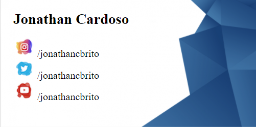

	
  

  
  

## :clipboard: Sobre o Projeto
Cartão de visita com links de redirecionamento para redes sociais.
  
  
 

  

 
 ## :computer: Tecnologias utilizadas

O projeto foi desenvolvido utilizando as seguintes tecnologias:

- HTML
- CSS

## :closed_book: Licença

Esse projeto está sob a licença MIT. Veja o arquivo [LICENSE](https://github.com/jonathancbrito/cartao-de-visita/blob/main/LICENSE) para mais detalhes.
